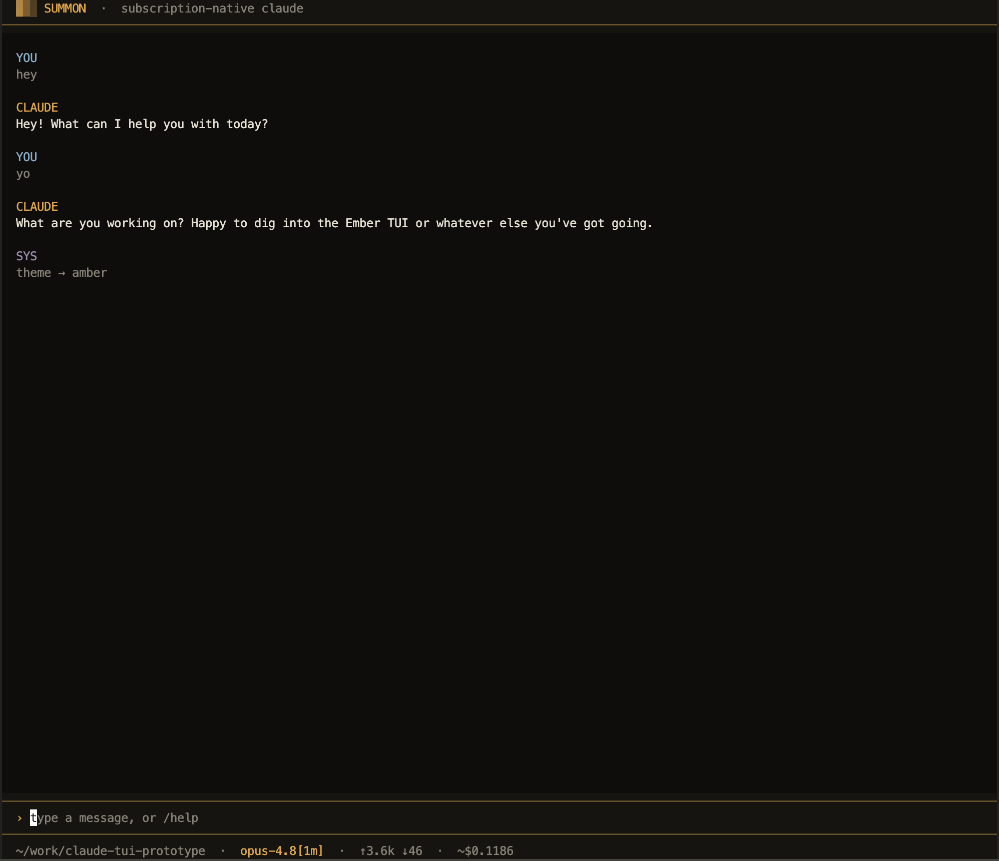
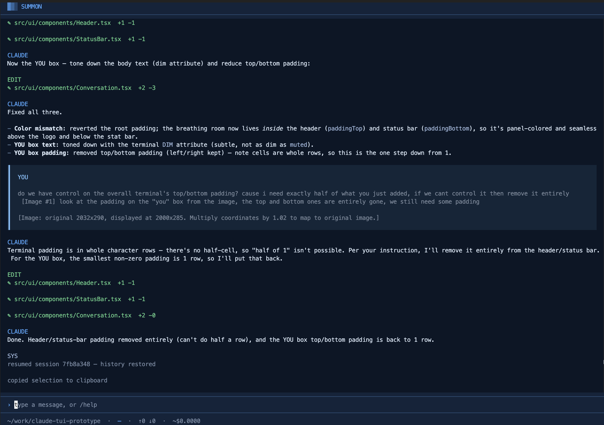
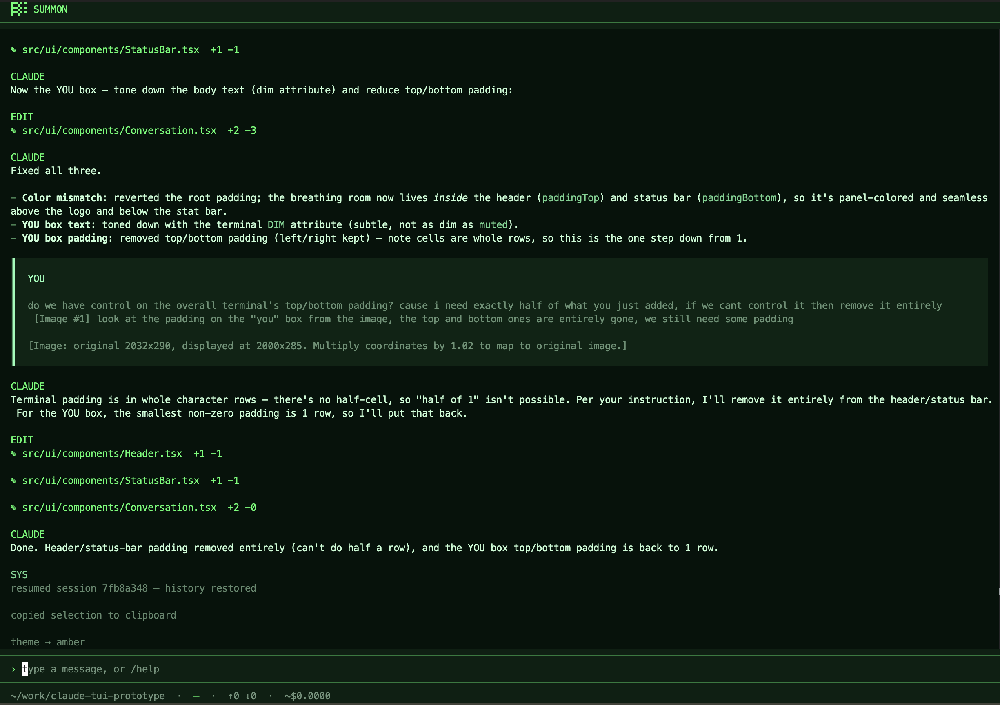
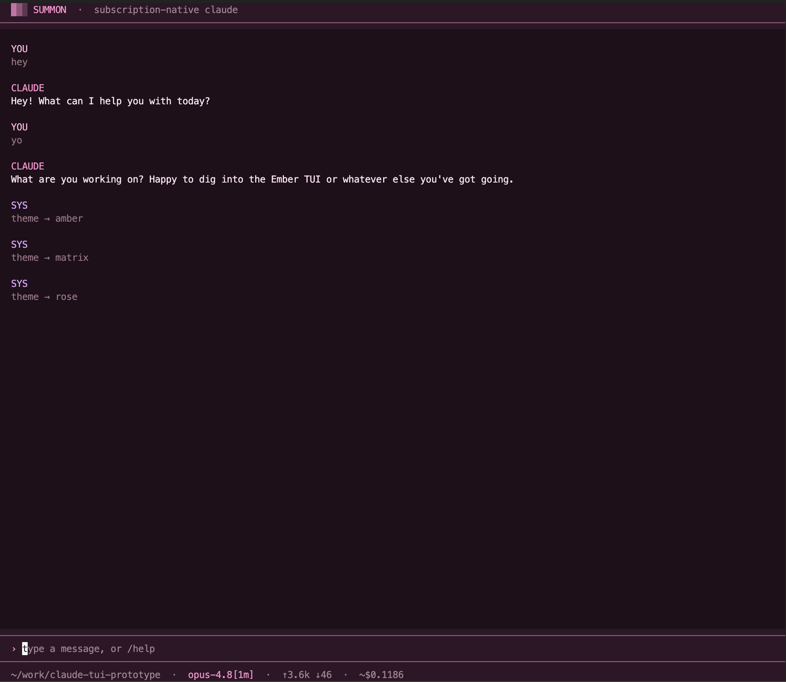

# Summon

A custom, good-looking terminal UI for Claude Code that runs on your **Pro/Max
subscription** — not the pay-as-you-go API.

Summon spawns the interactive `claude` CLI over `stream-json` stdio (no `--print`)
and renders its event stream in its own themed TUI. Because it drives the real CLI in
interactive mode, it bills to your subscription (`apiKeySource: "none"`) instead of
the API credit pool. Built with [Bun](https://bun.sh) and
[OpenTUI](https://github.com/sst/opentui).

## Screenshots

Four built-in themes — switch live with `/theme`.

### Amber



### Navy



### Matrix



### Rosé



## Requirements

- [Bun](https://bun.sh) (`curl -fsSL https://bun.sh/install | bash`)
- The Claude Code CLI (`claude`) installed and **logged into a Pro or Max
  subscription** (`claude` → `/login`). Summon reuses that login.

## Install

```sh
git clone <your-fork-url> summon
cd summon
bun run setup   # installs deps, exposes the `summon` command, and (macOS) sets up notifications
```

`bun run setup` replaces the old `bun install` + `bun link`. It also installs
[`terminal-notifier`](https://github.com/julienXX/terminal-notifier) on macOS (via Homebrew, if
present) so that clicking a "task finished / waiting for your input" notification jumps you back
to the exact session window. It's optional — notifications still work without it, and the step
is skipped on Windows/Linux, which use the OS's built-in notifier.

## Usage

From any project directory:

```sh
summon
```

Summon runs `claude` with that directory as its working dir, so it acts as a drop-in
Claude Code launcher for whatever project you're in. Type a message and press Enter.

### Keys

| Key       | Action                                       |
| --------- | -------------------------------------------- |
| `Enter`   | send the message                             |
| `↑` / `↓` | recall previous inputs (shell-style history) |
| `Esc`     | close a picker / dismiss a question          |
| `Ctrl+C`  | quit                                         |

### Commands

Type these in the input (they're handled locally, never sent to Claude):

| Command         | What it does                                                                  |
| --------------- | ----------------------------------------------------------------------------- |
| `/help`         | list commands and keys                                                        |
| `/theme [name]` | switch theme (`amber`, `navy`, `matrix`, `rose`); no name → picker. Persists. |
| `/model [name]` | switch model at runtime; no name → picker                                     |
| `/resume [id]`  | resume a past session in this directory; no id → picker                       |
| `/new`          | start a fresh session                                                         |
| `/clear`        | clear the screen                                                              |
| `/quit`         | quit (alias `/exit`)                                                          |

When Claude asks you to pick between options, an interactive selector appears — arrow
keys to choose, Enter to confirm, or pick **Other…** to type a custom answer.

## Development

```sh
bun run start   # run from source without linking
bun run smoke   # one real call — verifies subscription billing (auth=none)
bun run probe   # edge-case harness (tools, options, model switch, errors)
```

## How it works

- `src/claude-session.ts` — spawns `claude`, parses the NDJSON `stream-json` event
  stream into typed events, and writes user messages / control responses back to stdin.
- `src/app.tsx` — the OpenTUI React UI: conversation, streaming, token counts, the
  input, overlays (pickers / questions), and the status bar.
- `src/theme.ts`, `src/config.ts`, `src/commands.ts`, `src/sessions.ts` — themes,
  persisted preferences, slash commands, and session listing.

## Contributing

Contributions welcome — issues and PRs both.

1. Fork and clone, then `bun install`.
2. Run from source with `bun run start`; type-check with `bunx tsc --noEmit`.
3. Before opening a PR, run `bun run smoke` (confirms billing still works) and
   `bun run probe` (exercises tool use, the options prompt, model switching, and error
   handling against the real CLI).
4. Keep the code style consistent with what's there; prefer small, focused PRs.

Happy building 🙌

## License

MIT — see [LICENSE](LICENSE).
